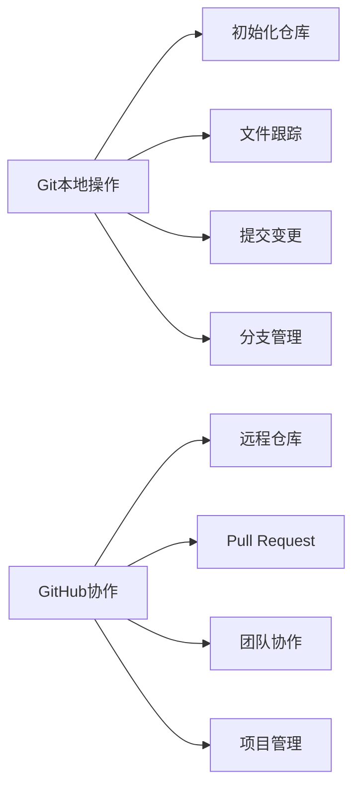
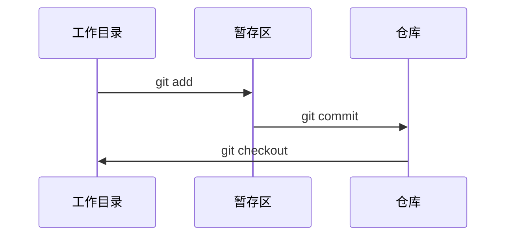
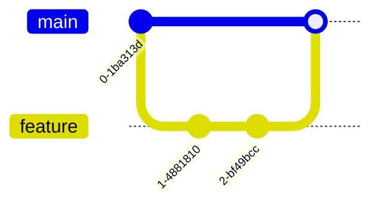

# Git & GitHub 从入门到精通指南 🚀

> 一份全面的版本控制与协作开发指南，助你成为Git专家！



## 📜 目录
1. [Git简介](#-git简介)
2. [环境配置](#-环境配置)
3. [基础操作](#-基础操作)
4. [分支管理](#-分支管理)
5. [远程协作](#-远程协作)
6. [高级技巧](#-高级技巧)
7. [最佳实践](#-最佳实践)
8. [GitHub实战](#-github实战)
9. [学习资源](#-学习资源)

---

## � Git简介
**Git** 是分布式版本控制系统，由Linus Torvalds创建，用于高效管理项目版本

### 核心概念
- **仓库(Repository)**：项目及其历史记录的存储位置
- **提交(Commit)**：项目在特定时间点的快照
- **分支(Branch)**：独立开发线，不影响主线
- **合并(Merge)**：将分支变更整合到主分支
- **远程(Remote)**：托管在服务器上的仓库副本

### Git vs GitHub
| 特性 | Git | GitHub |
|------|-----|--------|
| 类型 | 工具 | 平台 |
| 位置 | 本地 | 云端 |
| 功能 | 版本控制 | 协作+托管 |
| 部署 | 自托管 | SaaS |

---

## ⚙️ 环境配置

### 安装Git
- **Windows**：[下载安装程序](https://git-scm.com/download/win)
- **macOS**：`brew install git`
- **Linux**：`sudo apt install git` (Debian/Ubuntu)

### 首次配置
```bash
# 设置用户名
git config --global user.name "Your Name"

# 设置邮箱
git config --global user.email "your.email@example.com"

# 设置默认编辑器
git config --global core.editor "code --wait"  # VS Code

# 查看配置
git config --list
```

### 常用配置优化
```bash
# 启用彩色输出
git config --global color.ui auto

# 设置别名
git config --global alias.co checkout
git config --global alias.br branch
git config --global alias.ci commit
git config --global alias.st status

# 设置默认分支名
git config --global init.defaultBranch main
```

---

## 📍 基础操作

### 创建仓库
```bash
# 初始化新仓库
git init project-name
cd project-name

# 克隆现有仓库
git clone https://github.com/user/repo.git
```

### 工作流生命周期


### 基本命令
| 命令 | 描述 | 示例 |
|------|------|------|
| `git status` | 查看状态 | `git status` |
| `git add` | 添加文件到暂存区 | `git add file.txt` |
| `git commit` | 提交变更 | `git commit -m "消息"` |
| `git log` | 查看历史 | `git log --oneline` |
| `git diff` | 查看差异 | `git diff HEAD~1` |
| `git restore` | 撤销更改 | `git restore file.txt` |

### 忽略文件(.gitignore)
```
# 忽略所有.log文件
*.log

# 忽略目录
node_modules/
dist/

# 不忽略特定文件
!important.log
```

---

## 🌿 分支管理

### 分支操作
```bash
# 创建分支
git branch feature-x

# 切换分支
git checkout feature-x
# 或 (使用别名)
git co feature-x

# 创建并切换
git checkout -b hotfix

# 合并分支
git checkout main
git merge feature-x

# 删除分支
git branch -d feature-x
```

### 分支策略示例


### 解决冲突
当合并出现冲突时：
1. 打开冲突文件
2. 查找`<<<<<<<`, `=======`, `>>>>>>>`标记
3. 手动解决冲突
4. 添加解决后的文件：`git add resolved-file.txt`
5. 完成合并：`git commit`

---

## ☁️ 远程协作

### GitHub基础
1. 创建GitHub账号
2. 新建仓库(Repository)
3. 设置SSH密钥(推荐)

### 远程操作命令
```bash
# 添加远程仓库
git remote add origin https://github.com/user/repo.git

# 推送到远程
git push -u origin main  # 首次推送
git push  # 后续推送

# 从远程拉取
git pull origin main

# 克隆仓库
git clone https://github.com/user/repo.git

# 获取远程更新(不合并)
git fetch
```

### 协作流程
1. Fork上游仓库
2. 克隆你的Fork：`git clone your-fork-url`
3. 添加上游远程：`git remote add upstream original-url`
4. 创建特性分支：`git checkout -b new-feature`
5. 开发并提交变更
6. 推送到你的Fork：`git push origin new-feature`
7. 创建Pull Request(PR)

---

## 🔥 高级技巧

### 重写历史
```bash
# 修改最后一次提交
git commit --amend -m "新消息"

# 交互式变基(最近3次提交)
git rebase -i HEAD~3

# 重置到指定提交(谨慎使用!)
git reset --hard HEAD~1
```

### 储藏更改
```bash
# 临时保存工作进度
git stash

# 查看储藏列表
git stash list

# 恢复储藏
git stash pop  # 恢复并删除
git stash apply  # 恢复但不删除
```

### 高级日志
```bash
# 图形化日志
git log --graph --oneline --all

# 按作者搜索
git log --author="John"

# 按内容搜索
git log -S "function_name"
```

### 子模块
```bash
# 添加子模块
git submodule add https://github.com/user/lib.git

# 克隆包含子模块的仓库
git clone --recurse-submodules https://github.com/user/project.git
```

---

## 🏆 最佳实践

### 提交规范
```markdown
<类型>: <简短描述>

[可选正文]

[可选脚注]
```
常用类型：`feat`, `fix`, `docs`, `style`, `refactor`, `test`, `chore`

### 分支命名
- `feature/` - 新功能
- `bugfix/` - 错误修复
- `hotfix/` - 紧急修复
- `release/` - 发布准备

### 工作流建议
1. 频繁提交小变更
2. 保持提交原子化(一个提交一个变更)
3. 编写有意义的提交信息
4. 定期从上游拉取变更
5. 使用特性分支开发
6. 代码审查后再合并

### 推荐.gitconfig配置
```ini
[alias]
    co = checkout
    br = branch
    ci = commit
    st = status
    unstage = reset HEAD --
    last = log -1 HEAD
    graph = log --graph --abbrev-commit --decorate --format=format:'%C(bold blue)%h%C(reset) - %C(bold green)(%ar)%C(reset) %C(white)%s%C(reset) %C(dim white)- %an%C(reset)%C(bold yellow)%d%C(reset)' --all
```

---

## 💻 GitHub实战

### 高效使用GitHub
- **Issues**：任务管理和错误追踪
- **Projects**：项目管理面板(Kanban风格)
- **Actions**：自动化CI/CD流水线
- **Wiki**：项目文档
- **Discussions**：社区交流

### Pull Request最佳实践
1. 保持PR小型且专注
2. 清晰描述变更内容
3. 关联相关Issue
4. 添加截图/GIF演示(UI变更时)
5. 使用Markdown格式化内容
6. 及时回复审查意见

### GitHub快捷键
| 快捷键 | 功能 |
|--------|------|
| `t` | 文件查找器 |
| `s` | 焦点搜索栏 |
| `g c` | 跳转到Code标签 |
| `g i` | 跳转到Issues |
| `.` | 在网页编辑器中打开仓库 |

### GitHub CLI工具
```bash
# 安装
brew install gh  # macOS

# 常用命令
gh repo create  # 创建新仓库
gh pr create    # 创建PR
gh issue list   # 列出issue
gh gist create  # 创建Gist
```

---

## 📚 学习资源

### 官方文档
- [Git官方文档](https://git-scm.com/doc)
- [GitHub Docs](https://docs.github.com/)

### 交互式教程
- [Learn Git Branching](https://learngitbranching.js.org/)
- [GitHub Learning Lab](https://lab.github.com/)

### 推荐书籍
1. 《Pro Git》- Scott Chacon (免费在线版)
2. 《Git权威指南》- 蒋鑫
3. 《Version Control with Git》- Jon Loeliger

### 实用工具
- [GitKraken](https://www.gitkraken.com/) - 图形化Git客户端
- [SourceTree](https://www.sourcetreeapp.com/) - 免费Git GUI
- [GitHub Desktop](https://desktop.github.com/) - 官方桌面客户端

---

> "版本控制不是备份系统，而是时间机器，让你在代码的历史中自由穿梭。" - Git哲学

掌握Git和GitHub是现代开发者的必备技能。通过不断实践和探索，你将能够：
- 高效管理任何规模的项目
- 轻松协作开发
- 自信应对复杂版本控制场景
- 构建专业的开发工作流

开始你的Git之旅吧！🎯

> 内容由AI编写，如有错漏，请联系本人
> 相关AI：Deepseek